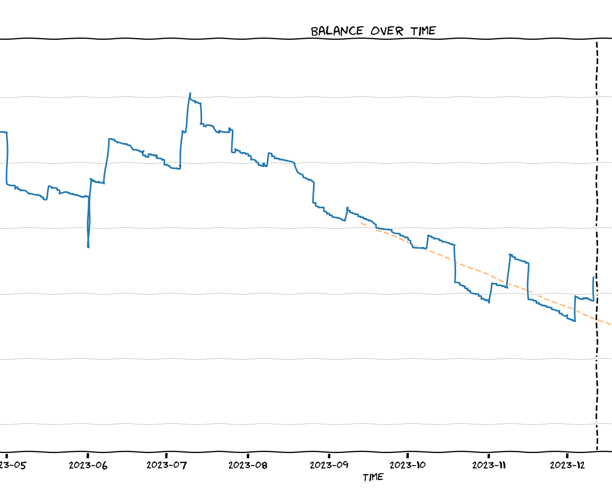

# Spending Graphs

Plotting balance over time with Starling Bank's [CSV export](https://www.starlingbank.com/features/statements/).

Features:

- combine multiple CSVs into one graph (Starling's maximum export is 1 year)
- show trend line for past N days
  - show average daily spending/earning for trend line period
  - work out estimated `TUZM` (Time Until Zero Money)



## How to use

Requirements: Python (with `matplotlib`, `numpy`)

Export CSV with Starling.

```bash
python .\plot.py --trendline 90 .\StarlingStatement_2022-05-26_2023-05-26.csv .\StarlingStatement_2023-05-26_2023-12-12.csv
```

## Notes

This could work with other banks. I don't know, because I don't have other banks. In principle, if their CSVs have a "date" and "balance" column then it will work. You will have to change this code to use the right CSV column and date format.
